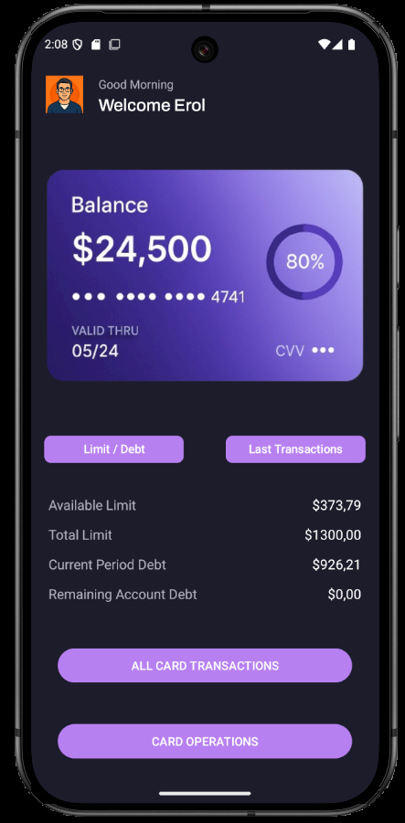
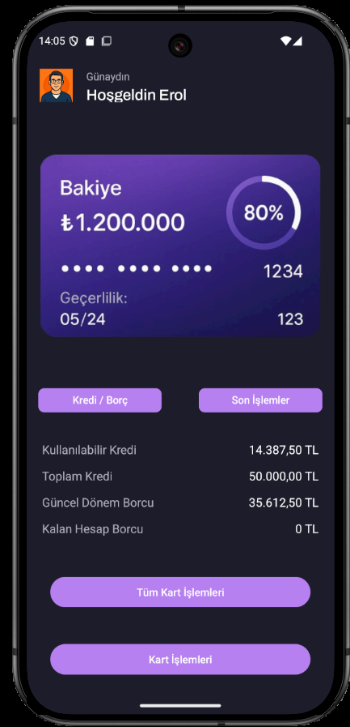
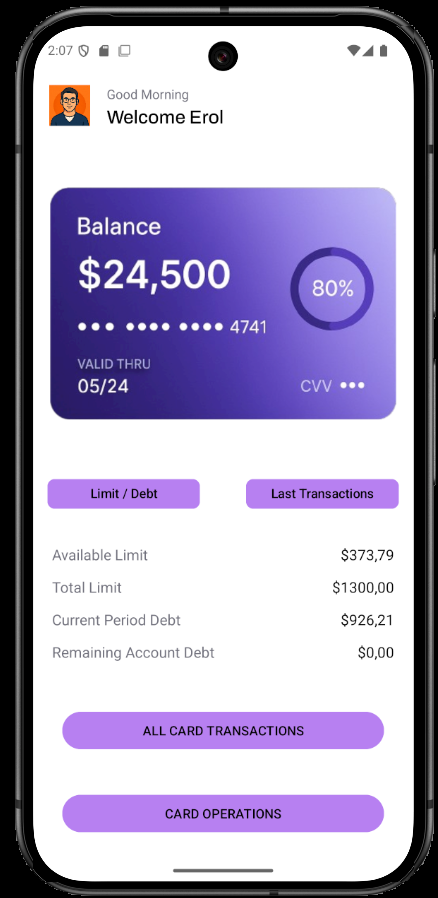
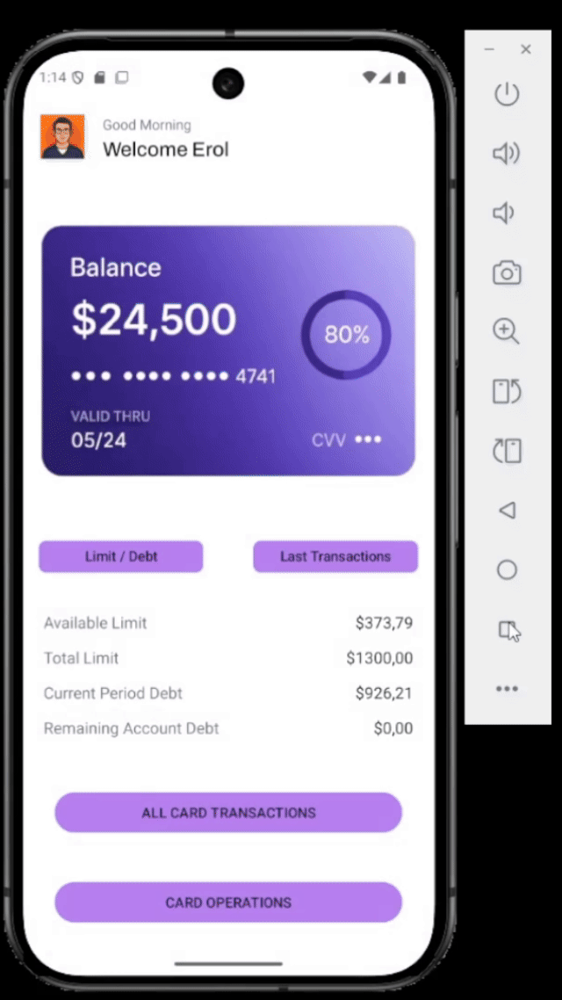
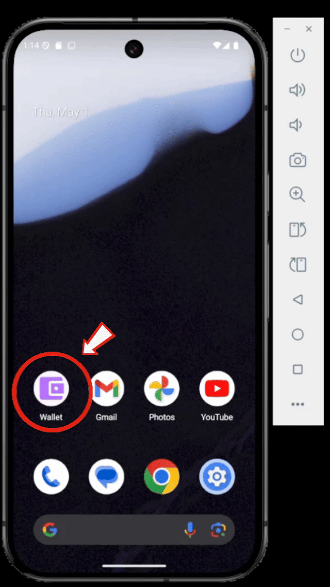

# Proje: Ana Sayfa Tasarım Çalışması

Bu proje, Android Studio kullanarak temel bir ana sayfa arayüzünün tasarım ve yapılandırma çalışmalarını içerir. Aşağıdaki konuları öğrendim ve uyguladım:

---

## Öğrendiklerim

### 1. Font Ekleme
- `res/font/` klasörüne `.ttf` veya `.otf` font dosyalarını koyarak
- XML'de `android:fontFamily="@font/archivo_medium"` şeklinde referanslayarak kullanımı öğrendim.

### 2. Resim Ekleme
- `res/drawable/` ve `res/drawable-tr/` (locale bazlı) klasör yapısını kullanarak:
  ```
  <ImageView
      android:src="@drawable/kullanici"
      android:layout_width="wrap_content"
      android:layout_height="wrap_content" />
  ```
- Cihaz dili Türkçe ise `drawable-tr/`, aksi hâlde `drawable/` içindeki doğru resim otomatik seçiliyor.

### 3. Dil (Locale) Desteği
- `res/values/strings.xml` (varsayılan)
- `res/values-tr/strings.xml` (Türkçe çeviriler)
- `<string name="hosgeldin">Hoşgeldin</string>` gibi çift dilli içerik.



### 4. Dark Mode / Light Mode
- `res/values/colors.xml` ve `res/values-night/colors.xml` ile renk paletlerini tanımladım.
- Temaya göre otomatik geçiş sağlandı.


### 5. Çoklu Ekran Desteği (Responsive UI)
- `dp` ve `sp` birimleri ile ölçülendirme:
  - `dp`: görsel eleman boyutları
  - `sp`: metin boyutları
- `wrap_content` ve `match_parent` kullanarak esnek layout düzeni.

### 6. Uygulama İkonu Ekleme
- `mipmap-*/` klasörlerine `ic_launcher.png` ve `ic_launcher_foreground.xml` dosyalarını yerleştirdim.
- `AndroidManifest.xml` içinde `<application android:icon="@mipmap/ic_launcher" ...>` referansını yaptım.



### 7. Layout Temelleri
- **ConstraintLayout** ile karmaşık düzenler
- **LinearLayout** + `layout_weight` ile eşit bölünmüş alanlar
- **Toolbar** ekleme:
  ```xml
  <androidx.appcompat.widget.Toolbar
      android:id="@+id/toolbar"
      android:layout_width="match_parent"
      android:layout_height="wrap_content"
      android:theme="?attr/actionBarTheme" />
  ```


